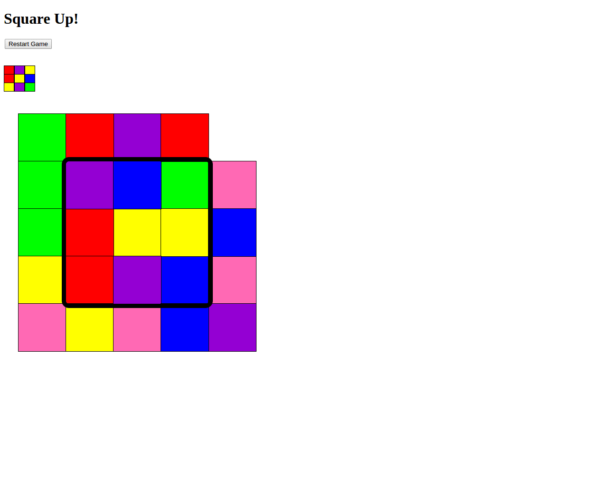

Square Up Game in Javascript
================

##Quick Game Summary
A Javascript game of "SquareUp". A puzzle game of 24 colorful squares in a 
5-by-5 grid that can only be moved to the empty spot to match a 'goal' 3-by-3 
grid. Once the inner area of the gameboard (3-by-3 grid) matches the goal grid,
the game ends.

###Gameplay Animation:
 
 

> Note that the game flashes an alert that the game has been won before the
> piece moved to the winning position. This is because the user clicked on the 
> last piece, therefore moving it to the final space which signaled a win before 
> the animation completed.
